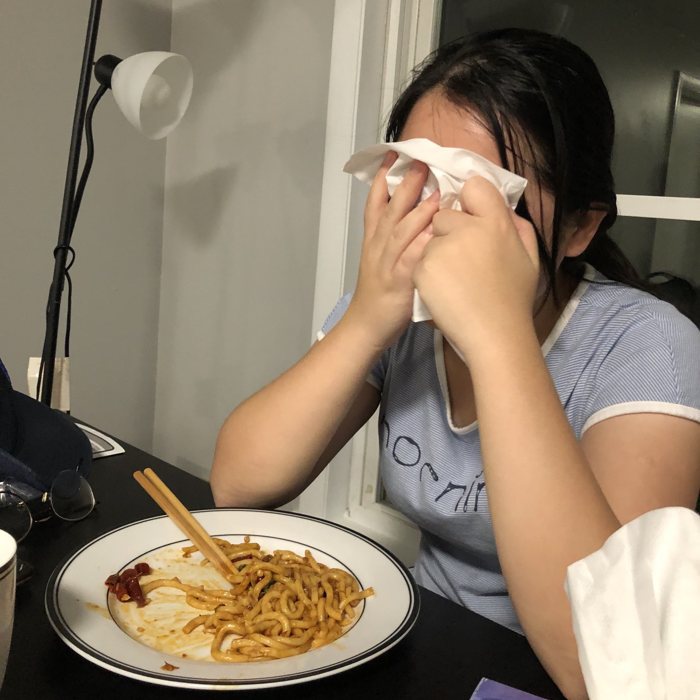

## The Touching Repo of All My Code ##

### About the Author ###
 
*Author was touched by the code!*

Class 7 Life Committee Member of the 2013 level, major in finance mathematics.

Graduation destination: UCI (a total of ten offers from Georgetown University, UCI, University of Georgia, SBU, OSU, KSU, Miami University, University of Delaware, University of Missouri, BGSU)

Has won honors: freshman start-up scholarship; 2016 outstanding students; 2015, 2016 National College Students Mathematical Modeling Excellence Award; 2014 Southern University of Science and Technology Debate Competition runner-up; Shude College Academy Logo Design Competition Participation Award; First President Cup Football More than the season army, basketball game runner-up, badminton than the season army; the first Academy Cup basketball than the season army.

The main deeds: Shenzhen Friendship City University Alliance and the One Belt and One Road University Summer Camp South University of Science and Technology Representative; Guangdong Provincial University Student Research and Innovation Funding Program Project Leader; Student Admissions Office Student Assistant; Mathematics Department Teaching Assistant; Reader Club President; School Women's Football Team, Basketball Team members; members of the Zhiren College football team, basketball team, badminton team.

## Objective ##

1. Brining the touching experience to everyone in the world.